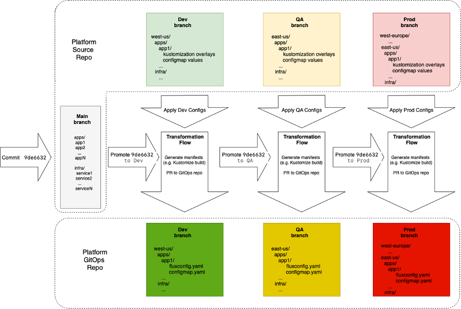

# Platform Configurations with GitOps 

This is a Platform Source Repo supporting the design concept of the GitOps setup for the platform configurations. 

## Use Cases

- Assign an application to clusters in environments (Dev, QA, Prod) and regions/groups (East US, West US, Europe)
- Provide configuration values for applications in different environments and in different cluster groups. E.g. Cosmo DB connection endpoints are “cosmodb.eastus.com”, “cosmodb.westus.com” and  “cosmodb.europe.com” for Dev and QA, but for Prod it’s “cosmodbprod.eastus.com”, “cosmodbprod.westus.com” and  “cosmodbprod.europe.com” that are backed up by the cosmodb instances in the “prod” azure subscription.
- Assign common infrastructure services to clusters in environments (Dev, QA, Prod) and regions/groups (East US, West US, Europe). E.g. fluentbit.
- Provide configuration values for infrastructure services in different environments and in different cluster groups. E.g. fluentbit is configured to propagate logs to different LA endpoints depending on the cluster group and environment. 

## Two Repos

### Platform GitOps repo. 
This is what platform team produces. It contains raw manifests organized in folders representing clusters or cluster groups. These folders can be consumed as is by Flux on corresponding clusters.  The repo is just a Git mirror of the fleet. It’s a desired state of the world, which is reconciled with the reality by Flux. It’s not good for manual update, though, therefore we came up with the “source” repo.

### Platform Source repo.
This is where platform team “models” the fleet. It’s supposed to be human oriented, easy to understand, update, review.  It contains manifest templates and config values. For example, fluentbit may be a helm chart with Kustomize overlays providing values for different environemnts and cluster groups. Application assignment may look like a FluxConfig with Kustomize overlays pointing to different places in the App GitOps repo depending on the cluster group and environment. 
There is an automated process that translates (applies kustomizations) and converts the source repo layout into the GitOps repo content. 

Essentially, the Platform Source repo and therefore Platform GitOps repo describe the layout of the following 3 categories across the clusters in the fleet:
-	Applications (e.g. hello-world app)
-	Infra services (e.g. fluentbit). They can be considered as applications as well, but produced by 3rd party teams.
-	Configuration values for applications and infra services (e.g. como-db endpoint, Log Analytics endpoints)

## Branches as Stages

In GitOps repo branches represent environments. 
Why: 
-	Security. Different branches/environments have different PR rules and are handled/reviewed by different people. A common approach is to combine all pre-prod environments in one repo (separated with branches) and keep prod environment in a separate repo.
-	Independency. PRs to different environments/branches are totally independent from each other. Otherwise, it will lead to confusing/blocking situations while rolling out and rolling back on different environments.
-	Visibility. PR history to a branch actually shows a deployment history to an environment.

## Challenge

Are there any changes to the fleet that the platform team should promote from a lower environment to higher environment? E.g. we check first that it works on Dev and only after that on Prod. Does it make any sense? If so, what is the best approach for the Source repo layout? How do we organize it, so it can be translated/converted into the GitOps repo automatically? 

The root of this question (if promotion makes sense) is in the fact that there are 3 different categories, that should be treated differently.
-	Applications. Application teams promote their changes on their own. Platform team is not involved in that. However, the assignment of the application to the clusters in environments may require a promotion – we don’t want a cluster killing app on Prod right away.
-	Infra services. Infra services are applications produced by 3rd party teams. This is the responsibility of the platform team to promote assignments and changes to the services (e.g. a new version) across environments. 
-	Configuration Values. Those are *not* promoted by definition. They are unique for each environment. So, when we need to provide cosmo-db endpoint for prod we do it directly on prod, through a PR process, though.

The proposal is to organize the Platform Source repo with multiple branches:
-	Main. Contains things to be promoted across environments/branches in the GitOps repo. Applications and Infra services. It doesn’t contain stage specific config values. It’s a base.
-	Dev, QA ,…, Prod. These branches contain environment specific config values (e.g. kustomization overlays, env values, etc.). So, for application assignments it will point to the correct app GitOps repo/brach/folder, for app and infra configs it will be env values for this environment.

A commit to the Main branch starts a promotion pipeline that performs a “transformation flow” for each environment one by one. A “transformation flow” takes the base manifests from Main, applies configs from a corresponding to this stage branch (Dev, QA,..Prod) and PRs the resulting manifests to the GitOps repo in the corresponding to the environment branch. Once the rollout on this environment is complete and successful, the promotion flow goes ahead and performs the same procedure on the next environment. On every environment the flow promotes the same commitid of the main branch, making sure that the content from “main” is getting to the next environment only after success on the previous stage.

A commit to the “config” branch (Dev, Qa, …Prod) in the Source repo will just start a “transformation flow” for this environment. E.g. we have changed cosmo-db endpoint for QA, we just need to make updates to the QA branch of the GitOps repo, we don’t want to touch anything else. The “transformation flow” will take the “main” content corresponding to the latest commitid promoted to this environment, apply configurations and PR the resulting manifests to the GitOps branch.

Alternatively to the environment/config branches, the environment specific config values may be stored in the Main branch in some “config” folders.  But with this approach we loose all the benefits (Security, Independency, Visibility) described in “Branches as Stages”. We won’t be able to track and react on config commits to the stages independently. But the main argument against this approach is that nature and the lifecycle of the “Main” content and “config” content are very different. What is in “Main” is a subject to be promoted, what is in “config” is not.

## Prototypes

•	[Source repo prototype](https://github.com/kaizentm/platform-src) (this repo)
•	[GitOps repo prototype](https://github.com/kaizentm/platform-gitops)

## Other thoughts

-	It makes sense to have two level hierarchy under apps and infra. For apps it will be tenant/app and for infra it can be group/service (e.g. monitoring/prometheus). At the first level manifests would define a namespace and RBAC. Ideally, customer should decide the hierarchy level on their own and our solution should be flexible and fine with any.

